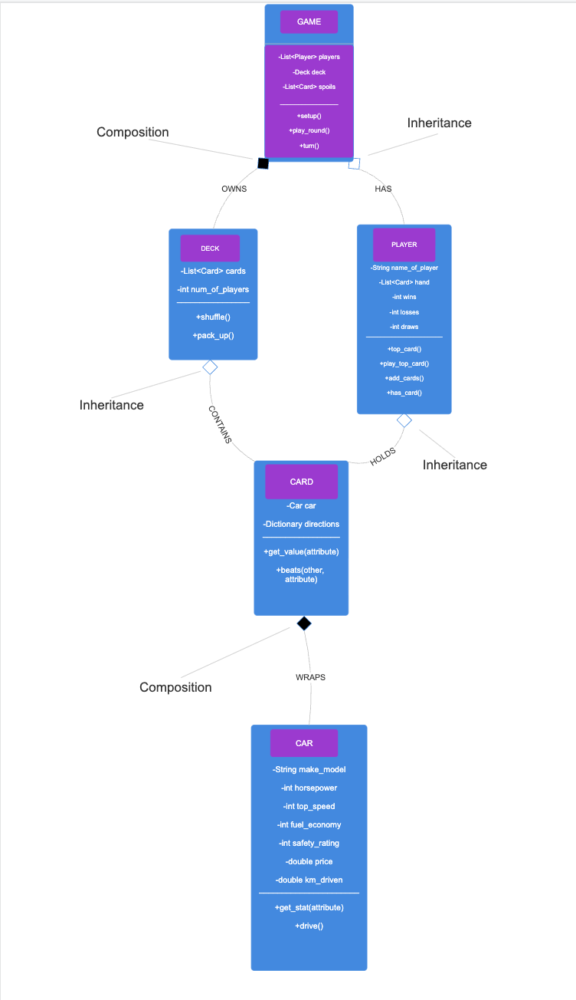

# Part C - Class Diagram

# DECISION 1 - Separate *Car* (data) from *Card*
The decision was to make `Car` store the raw listing values, and `Card` wraps a `Car` and adds critical gameplay behaviour (such as direction makes the player win and a comparision feature)
The alternative was to combine the class, which meant one would hold all the stats and game methods, however it was rejected because, it would lead to a single responsibility issue, which meant that the data source changes (new stats, or different CSV), only `Car` changes and if the rules change (how the stat wins, or how cards compare), only `Card` changes. They never interfere so `Car` is resusable.

# DECISION 2 - Encapsulate each player's hand ( with private attribute, public methods)
The decision was to make `Player.hand` for example private, and other classes only touch it with `top_card()`, `play_top_card()`, `add_cards()`.
The alternative which was to make the `hand` public, so `Game` can add and remove cards from player directly. This decision was made because the card movement runs through controlled methods, so `Game` can`t corrupt a hand, making less errors and easier to debug. Even though their might more methods to be written, it makes the code more clear and easier to use and allows each deck to stay indepedent from each other.
