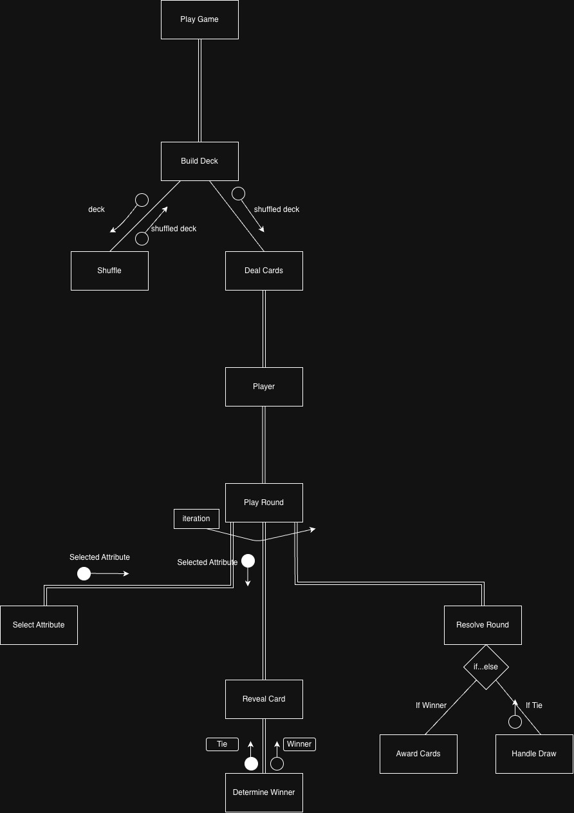

# Part D - Game Mechanics

### How each round is played
Each player has a face down pile and can see only their own top card. The player who is going, picks one attribute Every player then reaveals their top card's value for that specific attribute, the values are than compared, and the person with the best one stat (whter it is higher or lower) wins. The winner takes all the played cards (or any tie cards over from an eariler draw) puts them at the bottom of their hand. They become the next caller. 

### How attributes are selected
Only the current caller chooses the  attribute that they want to compete with. They pick the strongest attirbute on their top card and will use it for this round. It can be the highest value, or for a reverse-direction stat like `km_driven` or the the lowest. Then everyone reveals their stat 

### How winners are determined
Each player value for the claled attribute is compared using that attributes win-direction from the `direction` method. Higher-win stats, horsepower, top speed and the lower-win stats are `km_driven`, goes to the lowest.

### What happens in a draw
If two or more top cards share the best value, no one wins immediately. All the played cards go into a different pile in the middle and another round is played right after, whoever wins that round collects the middle deck cards. The caller stays the same during that round

### How the game ends
The rounds repeat until one player has collected every card and the others have empty hands, so that player wins. Although most games have a cap

### Game Balance
The deck is balanced when no single card or stat can dominate over a majority. So both skill and luck matter and games stay close and competitve. Although there is a dependency on if the ***attributes*** are fair and with a wide spread so it is decisive, no attributes give a guaranteed winner eveyrtime and the values are normalised so extreme outliers can't just win immediately. So in a balanced deck, whoever happens to hold any card has a fair shot with it.

### An unfair advantage; how to fix it
The clearest one is the outlier card. If even a single card carries an extreme value which doesn't fit in with the majority of the cards, such as a car with 1000HP (horsepower) while most cars sit at 200-300 HP, someone who is dealt this card can call horsepower everytime and win eveyrtime. One card becomes an automatic win so it stops being competitive. The solution is to band every stat into a common number rating ( such as 1-10 or even 1-100), this curates the deck so values are evenly distributed rather than just sample. The card stays strong but it is beatable, so cards that hold a 9 or 10 can match it or beat it. This restores balance in the game

