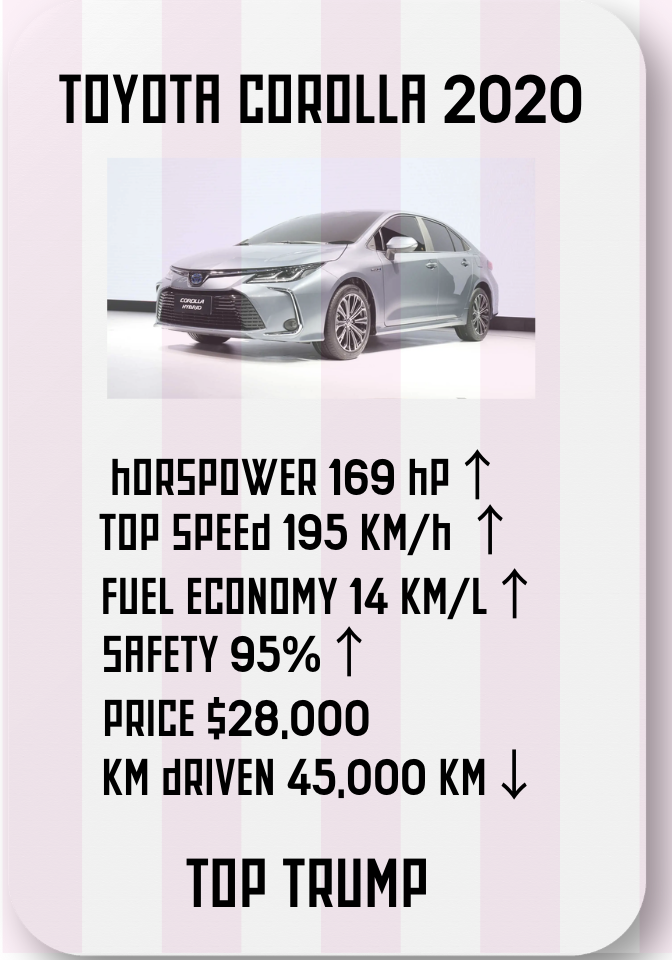
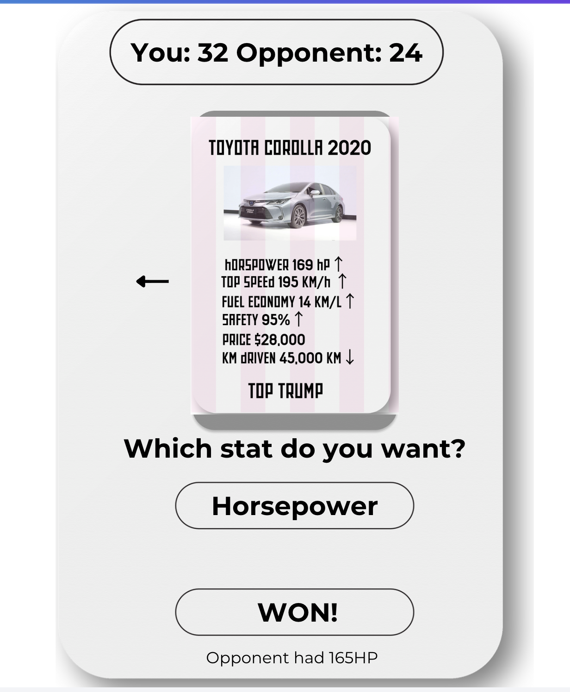
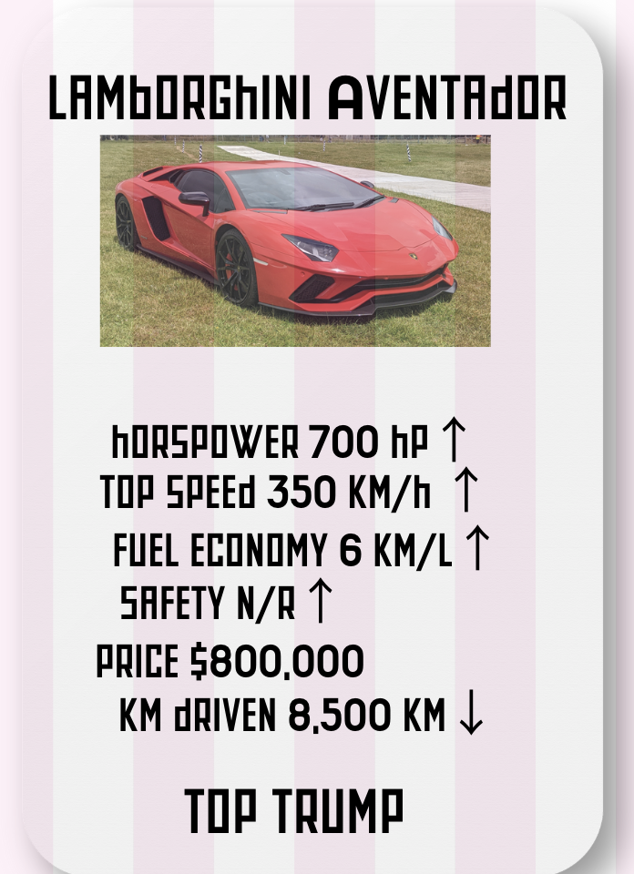
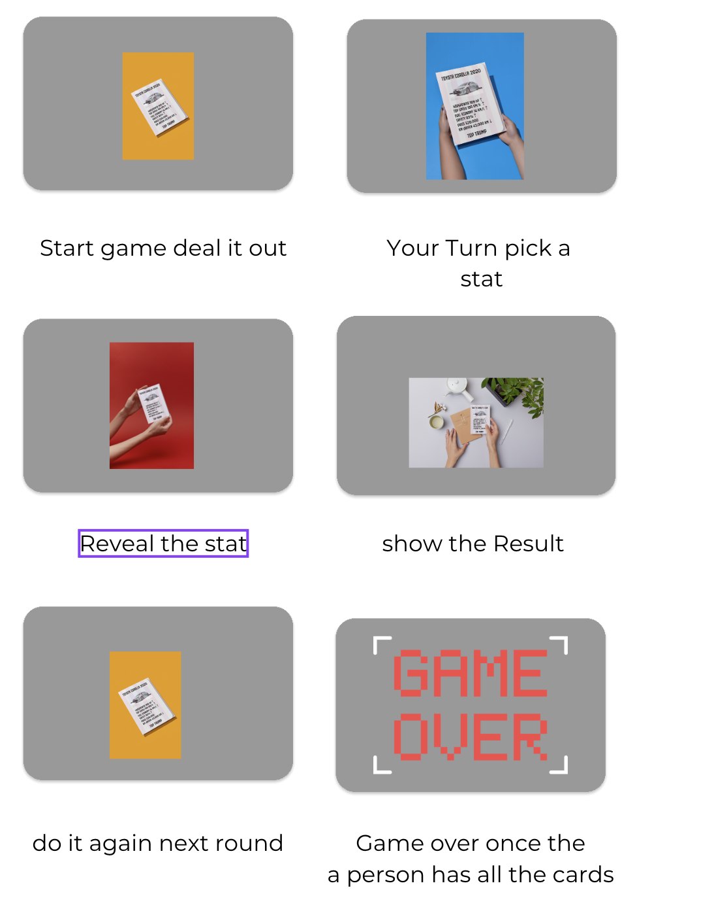

### Part E — Interface and Card Design.md

 

We included a name + year, a photo adn the 6 stats we named, in the same order everytime, the direciton arrows tells us what direction is better for the win. There is a consistent border and colour. 
We chose it becasue the tappable stats, are the real choice that hte player makes, the card counts equals who's winning and the cosnsitent card layout, so the players always know here to look.

 

